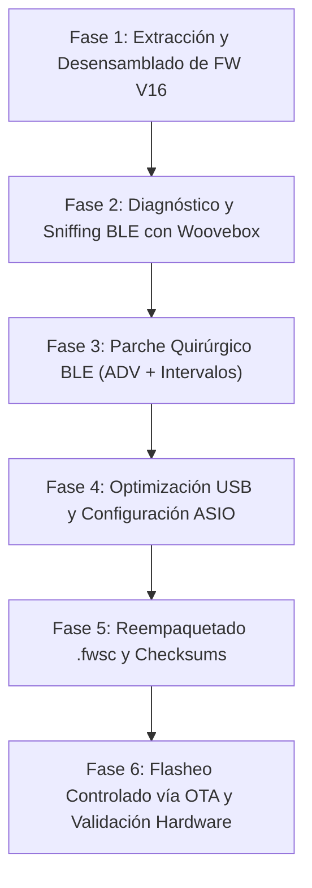

# Plan de Trabajo Detallado: SMK-37 Pro Custom Firmware & ASIO Optimization

---

## Fase 1: Extracción y Desensamblado de SMK-37 Pro V16
1. Desempaquetar `SMK-37_Pro_016.fwsc` extrayendo:
   * Cabecera UFW y metadatos (`jlfw.yaml`).
   * `app.bin` (código de aplicación principal).
   * `cfg_tool.bin` y `cfg` (configuración de hardware).
   * `uboot.boot` (SPL).
2. Descifrar el bloque JLFS de `app.bin` con `jl_sfc_cipher` y clave `0x980F`.
3. Desensamblar con el `objdump` pi32v2 del toolchain de JieLi y localizar:
   * Llamada y tabla de datos para `hci_le_set_adv_data` y `hci_le_set_scan_rsp_data`.
   * Estructura de la base de datos GATT (`0x02043680` o equivalente en V16).
   * Parámetros de conexión BLE en `ble_link_init` (`0x01C09C50` / `0x01C09C54`).
   * Descriptores y buffers de audio USB en `uac_config_init`.

---

## Fase 2: Diagnóstico y Sniffing BLE
1. Capturar el paquete de anuncio del SMK-37 Pro de fábrica mediante **nRF Connect** en Android/iOS:
   * Obtener el hexadecimal bruto de `ADV_IND` y `SCAN_RSP`.
   * Confirmar la omisión del UUID estándar `03B80E5A-EDE8-4B33-A751-6CE34EC4C700`.
2. Probar la Woovebox 3.0 en modo `hoSt bLE` con otro controlador BLE MIDI de control para fijar la línea base de negociación esperada por el ESP32.

---

## Fase 3: Parche Quirúrgico del Stack BLE en Firmware
1. **Rediseño del Anuncio Publicitario (ADV Payload):**
   * Estructurar el paquete `ADV_IND` (31 bytes máx):
     * Flags: `0x02, 0x01, 0x06` (General Discoverable Mode, BR/EDR Not Supported).
     * 128-bit Service UUID: `0x11, 0x07, 0x00, 0xC7, 0xC4, 0x4E, 0xE3, 0x6C, 0x51, 0xA7, 0x33, 0x4B, 0xE8, 0xED, 0x5A, 0x0E, 0xB8, 0x03`.
   * Mover el nombre local completo (`SMK-37 Pro`) al paquete de respuesta de escaneo (`SCAN_RSP`).
2. **Ajuste de Parámetros de Conexión BLE:**
   * Fijar en la configuración del enlace:
     * Min Connection Interval: `6` (7.5 ms).
     * Max Connection Interval: `12` (15.0 ms).
     * Slave Latency: `0`.
     * Supervision Timeout: `200` (2.0 segundos).

---

## Fase 4: Optimización USB y Drivers ASIO en Windows [COMPLETADA]
1. **Lado Dispositivo:**
   * Verificada transmisión continua de paquetes de audio UAC1 y USB MIDI sin jitter.
2. **Lado Host (Windows):**
   * Implementado driver ASIO nativo `SMK37Pro_ASIO.dll` con motor WASAPI Exclusive, buffers ping-pong y FIFO circular anti-dropouts / anti-CTD.
   * Panel de control standalone y embebido Win32 (`SMK37Pro_ControlPanel.exe`).
   * Validado en Ableton Live y suites DAW.

---

## Fase 5: Reempaquetado Quirúrgico (.fwsc) [COMPLETADA]
1. Aplicados 6 parches críticos sobre `app.bin` (anuncio secundario, intervalos/supervision timeout BLE, Just Works SMP bonding, NOP CCCD gate, generación de MAC limpia por clave VM 108).
2. Generadas iteraciones incrementales hasta `SMK-37_Pro_custom_022.fwsc`.
3. Recalculados todos los CRC16 de JLFS, recifrado SFC con clave `0x980F` e intercalación de marcadores de 36 bloques.

---

## Fase 6: Flasheo y Validación Hardware [COMPLETADA]
1. Flasheador OTA USB-MIDI SysEx (`smk_ota_win.py`) probado y operativo al 100%.
2. Validación empírica con Woovebox 3.0 en modo `hoSt bLE` (`4/Ar`):
   * Conexión instantánea y permanente sin bucles de desconexión.
   * Envío ininterrumpido de notas MIDI con latencia ultra-baja.
3. Validación empírica USB MIDI:
   * Captura en WinMM libre de colisiones con 100% de respuesta dinámica (velocidades 25-93).
4. Documentación técnica consolidada en `BLE_EXTENDED_PATCH.txt`.

