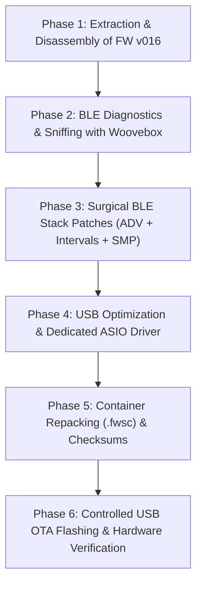

# Detailed Project Roadmap: SMK-37 Pro Custom Firmware & ASIO Optimization

---

## Phase 1: Extraction & Disassembly of SMK-37 Pro v016 [COMPLETED]
1. Unpack `SMK-37_Pro_016.fwsc` extracting:
   * UFW container and metadata (`jlfw.yaml`).
   * `app.bin` (main application code).
   * `cfg_tool.bin` and `cfg` (hardware pinouts and configuration).
   * `uboot.boot` (SPL).
2. Decrypt the JLFS block of `app.bin` with `jl_sfc_cipher` and chipkey `0x980F`.
3. Disassemble using the JieLi `pi32v2` objdump:
   * Locate `hci_le_set_adv_data` and `hci_le_set_scan_rsp_data`.
   * Map the GATT database structure (`0x02043680`).
   * Trace BLE connection parameters in `ble_link_init`.
   * Trace USB audio descriptors and buffers in `uac_config_init`.

---

## Phase 2: BLE Diagnostics & Sniffing [COMPLETED]
1. Capture stock SMK-37 Pro advertising packets via **nRF Connect**:
   * Inspect raw `ADV_IND` and `SCAN_RSP` frames.
   * Analyze secondary advertising trigger when CCCD 0x2902 is enabled.
2. Test Woovebox 3.0 in `hoSt bLE` mode to establish expected ESP32 negotiation baseline.
3. Diagnose GATT notification gating and host NVS bonding record caching.

---

## Phase 3: Surgical BLE Stack Patches in Firmware [COMPLETED]
1. **Secondary Advertising Bypass:**
   * NOP out the secondary multi-client advertising trigger upon notification subscription (offset `0x0013D2`).
2. **Connection Parameters & Supervision Timeout:**
   * Increase supervision timeout to 4,000 ms and expand connection interval ceiling to 20-30 ms (offset `0x05839E`).
3. **Security Manager Protocol (SMP):**
   * Enforce unauthenticated "Just Works" pairing with bonding enabled (`auth_req = 0x01`, `IO_CAP = 3`, remove mandatory Secure Connections).
4. **Unconditional Notification Dispatch:**
   * Bypass CCCD check in `ble_midi_tx_packet_dispatch` (offset `0x000AEE`).
5. **Fresh MAC Address Generation:**
   * Redirect flash VM key from 102 to 108 (offsets `0x0035CE`, `0x003668`) to clear stale host bond caches.

---

## Phase 4: USB Optimization & Dedicated Windows ASIO Driver [COMPLETED]
1. **Device Subsystem:**
   * Verify continuous UAC1 audio streaming and low-jitter USB-MIDI message queues.
2. **Host Driver (Windows):**
   * Implement native user-mode COM InProc driver `SMK37Pro_ASIO.dll` with WASAPI Exclusive engine and ping-pong buffers.
   * Implement circular FIFO ring buffer with drift clamping to eliminate dropouts and DAW crashes (CTD).
   * Build standalone and embedded Win32 Control Panel (`SMK37Pro_ControlPanel.exe`).
   * Validate across Ableton Live, Reaper, and FL Studio.

---

## Phase 5: Container Repacking (.fwsc) [COMPLETED]
1. Apply binary assembly patches on decrypted `app.bin`.
2. Increment internal version strings and trailer markers to `SMK-37 Pro_022`.
3. Recalculate all JLFS entry CRCs, `app_area_head` CRC, and UFW container header CRCs.
4. Re-encrypt with `jl_sfc_cipher` (chipkey `0x980F`) and generate production binary `SMK-37_Pro_custom_022.fwsc`.

---

## Phase 6: Flashing & Hardware Verification [COMPLETED]
1. Implement zero-dependency Windows SysEx OTA flasher (`smk_ota_win.py`) using `winmm.dll`.
2. Empirical validation on hardware with Woovebox 3.0 in `hoSt bLE` (`4/Ar` mode):
   * Instantaneous, permanent connection with solid "bt" LED.
   * Continuous, real-time MIDI note transmission with near-zero latency.
3. Empirical USB-MIDI validation:
   * WinMM direct capture showing clean dynamic velocity tracking (25-93) across all 37 keys with 0 stuck notes.
4. Comprehensive technical documentation consolidated in `BLE_EXTENDED_PATCH.txt`.
