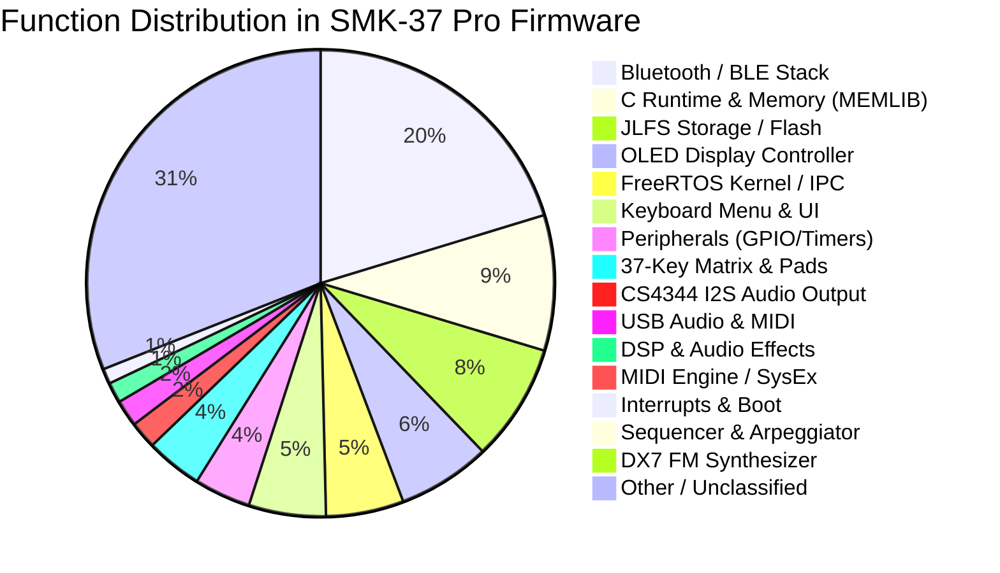

# M-VAVE SMK-37 Pro Firmware Architecture & Memory Map

This document details the internal architecture, memory layout, decompiled subsystems, cataloged functions, and C/ASM recompilation & code cave injection pipeline for the **M-VAVE SMK-37 Pro** keyboard controller/synthesizer (stock v016 and custom v022).

---

## 1. Hardware Specifications & Architecture

| Parameter | Technical Details |
|---|---|
| **SoC / MCU** | JieLi (JL) AC791N / WL82 series |
| **CPU Core** | Dual-Core 32-bit RISC `pi32v2` (Compact 16/32-bit instructions, software FPU / optimized routines) |
| **Clock Frequency** | Up to 240 MHz (Dynamically configured by `pll_clock_init`) |
| **Flash Memory** | SPI NOR Flash XIP (eXecute-In-Place) mapped at `0x02000000` |
| **RAM Memory** | Internal SRAM at `0x01C00000` .. `0x01C80000` (512 KB max) |
| **Audio DAC** | Cirrus Logic CS4344 (24-bit, 192 kHz, stereo I2S with hardware DMA) |
| **Connectivity** | USB 2.0 Full-Speed (UAC Audio + USB MIDI), Bluetooth 5.0 Dual Mode (BLE-MIDI + BT Classic) |
| **User Interface** | 37-key keybed with dual velocity sensors, 8 velocity/aftertouch RGB backlit pads, 4 continuous encoders, 2 capacitive touch strips (Pitch Bend & Modulation), OLED display |

---

## 2. Firmware Container Format (`.fwsc` & `JLFS`)

The OTA update file (`SMK-37_Pro_016.fwsc`) is a proprietary container structured into multiple encapsulation and encryption layers:

```
+---------------------------------------------------------------------------------+
| FWSC Container (Interleaved 36 blocks with 36-byte trailer markers)             |
+---------------------------------------------------------------------------------+
                                      |
                           [deinterleave_fwsc]
                                      v
+---------------------------------------------------------------------------------+
| Logical UFW Container (Scrambled header with key 0xFFFF, IBM CRC16)             |
|   - flash.bin (643,072 bytes at offset 0x000400)                                |
|   - ota.bin, isd_config.ini, blimit.bin, tail.bin                               |
+---------------------------------------------------------------------------------+
                                      |
                           [JLFS Partition Parser]
                                      v
+---------------------------------------------------------------------------------+
| flash.bin Layout:                                                               |
|   0x000000 .. 0x003FFF : Bootloader SPL (uboot.boot) & config (isd_config.ini)  |
|   0x004000 .. 0x09B757 : App Area (Encrypted with JieLi SFC Cipher, key 0x980F) |
|     -> 0x004000: JLFS entry "app_area_head"                                     |
|     -> 0x004020: JLFS entry "app.bin" (pointer to 0x004120)                     |
|     -> 0x004040: JLFS entry "cfg_tool.bin"                                      |
|     -> 0x004120 .. 0x09B5D8: Executable binary "app.bin" (619,704 bytes)        |
|   0x09B757 .. END      : EQ resources and calibration ("cfg")                   |
+---------------------------------------------------------------------------------+
```

### Cryptographic Algorithms & Checksums
- **UFW Scrambler:** `jl_enc_cipher` (Arithmetic shift XOR with fixed header key `0xFFFF`).
- **App Area Encryption:** `jl_sfc_cipher` (JieLi SFC Hardware Cipher with chipkey `0x980F` / decimal `38927`).
- **Integrity Verification:** `jl_crc16` IBM polynomial (`0x8005`, init `0x0000`).

---

## 3. Memory Map of `app.bin` (VMA Flash `0x02000000`)

At boot, the hardware memory-maps the SPI Flash directly into linear XIP address space starting at `0x02000000`:

| Address Range (VMA) | Offset in `app.bin` | Size | Description & Functionality |
|---|---|---|---|
| `0x02000000` .. `0x020000A0` | `0x000000` | 160 B | **Reset Vector (CRT0)**: Initializes Stack Pointer (`0x01C3A464`), SSP (`0x01C3B464`), clears RAM `.bss` section, and copies initialized `.data`. |
| `0x020000A0` .. `0x02002874` | `0x0000A0` | ~10 KB | **System Core**: PLL clock driver (`pll_clock_init`), interrupt vector table, circular buffer `cbuf` queues. |
| `0x02002874` .. `0x02048000` | `0x002874` | ~277 KB | **FreeRTOS Kernel & Bluetooth Stack**: RTOS task scheduler, baseband radio controller (BR/EDR/BLE), GATT/ATT protocol stack, L2CAP and Security Manager (SMP). |
| `0x02048000` .. `0x02057000` | `0x048000` | ~60 KB | **Peripheral & USB Drivers**: USB SIE, 44.1kHz Stereo UAC Audio and USB-MIDI Class 1.0 endpoints, serial UART, SPI/I2C. |
| `0x02057000` .. `0x0205E000` | `0x057000` | ~28 KB | **Audio Routing, BLE-MIDI, UI & Sequencer**: `usr_audio_task`, `midi_route`, BLE-MIDI service descriptors (UUID `03B80E5A...`), display menu. |
| `0x0205E000` .. `0x0208D000` | `0x05E000` | ~188 KB | **DX7 FM Synth Engine (Dexed / MSFA)**: 6-operator Yamaha DX7 integer synthesis core, 32 algorithms, 4-stage envelope generators, LFO (`dx7_lfo_params_compute`). |
| `0x0208D000` .. `0x02096800` | `0x08D000` | ~38 KB | **OTA Loader & C Runtime Libs**: `update_pkg_parse_verify`, JLFS parser, SFC cipher routines, and `libc` routines (`memcpy`, `memmove`, `memset`, math). |
| `0x02096800` .. `0x02096DA0` | `0x096800` | **1,440 B** | **Primary Code Cave (Flash Cave 1)**: Continuous range of unused `0x00` padding bytes, available for injecting custom C/ASM routines. |
| `0x02096DA6` .. `0x020971B0` | `0x096DA6` | **1,034 B** | **Secondary Code Cave (Flash Cave 2)**: Additional padding range available for future expansion. |
| `0x020971B0` .. `0x020974B8` | `0x0971B0` | ~776 B | File trailer structures, interface descriptor pointers. |

---

## 4. Decompiled Subsystem Classification

Through machine code disassembly analysis, cross-referencing with the `FM-1-RE` database (2,062 functions), and matching against the official JieLi SDK, **2,203 functions** have been cataloged in Flash:



### 4.1 Bluetooth & BLE-MIDI Subsystem (`BT`) — 441 Functions
- **Advertising Controller:** `0x0200075E` (`bt_ble_adv_enable`).
- **Official BLE-MIDI UUID (128-bit):** Located at `0x0205838E`:
  `03B80E5A-EDE8-4B33-A751-6CE34EC4C700` (little-endian: `00 C7 C4 4E E3 6C 51 A7 33 4B E8 ED 5A 0E B8 03`).
- **BLE Connection Parameters Table (`0x0205839E`):**
  - Patched in v022 for rock-solid stability with embedded hosts (supervision timeout 4,000 ms, relaxed intervals 7.5-20 ms / 15-30 ms).
- **GATT Event Callbacks:** `ble_ll_set_event_handler` (`0x020037F6`, `0x02003BA8`).

### 4.2 MIDI Engine Subsystem (`MIDI`) — 16 Core Functions
- `0x02000660` (`midi_ctrl_packet_dispatch`): 4-byte MIDI control packet receiver (`0xD0`/`0xD4`) from USB or BLE.
- `0x02000694` (`midi_slot_is_active`): Validates if a voice slot is active.
- `0x020006B8` (`midi_slot_find`): Free voice search for polyphony.
- `0x0200083C` (`midi_slot_match`): Note and channel matcher for Note-Off events.
- `0x02000AA6` (`midi_msg_prefilter`): Main router and message filter for incoming MIDI.

### 4.3 Audio & CS4344 DAC Subsystem (`AUDIO_OUT` / `AUDIO_DSP`) — 72 Functions
- `0x02008724` (`uac_config_init`): Configures I2S sample rate (44,100 Hz, 16-bit stereo).
- `0x02008D72` (`uac_sync_rate_init`): Synchronizes I2S clock to USB SOF (Start of Frame).
- `0x02058370` (`usr_audio_task`): Top-priority FreeRTOS audio rendering task feeding the CS4344 DAC DMA buffer.

### 4.4 DX7 FM Synthesizer Subsystem (`SYNTH_FM`)
- `0x020057E0` (`dx7_lfo_params_compute`): Fixed-point pitch modulation, amplitude modulation, and LFO rate calculations.
- Algorithms 1 to 32 of Yamaha DX7 with frequency-modulated sine operators.
- Internal strings: `"Enable PATCH first"`, `"Disable arp & note repeat to enter"`.

### 4.5 USB UAC + MIDI Subsystem (`USB`) — 40 Functions
- `0x020087DA` (`usb_sie_init`): Hardware USB Serial Interface Engine initialization.
- `0x02008776` (`usb_config_desc_build`): Builds composite USB descriptor (Audio Device + MIDI Streaming Interface).
- `0x020081C4` (`usb_ep_read`): Reads incoming packets from the USB endpoint FIFO.

---

## 5. C/ASM Recompilation & Hooking Toolchain

The repository includes a fully automated build toolchain:

```
tools/
├── patch_firmware.py            # C/ASM compiler, linker, hook injector, and .fwsc repacker
├── test_recompilation_pipeline.py# Comprehensive automated pipeline test
├── repack_smk.py                # Automated repacker and SFC re-encryptor for .fwsc
├── unpack_smk.py                # JLFS/UFW unpacker and SFC decryptor
├── cross_reference_fm1.py       # Decompiler cross-referencing and function cataloger
└── smk_ota_win.py               # Zero-dependency Windows USB-MIDI SysEx OTA flasher
```

### 5.1 Workflow for Injecting Custom Code
1. **Create C or ASM file** (e.g. `firmware_work/my_feature.c`).
2. **Import firmware symbols**: `firmware_work/firmware_symbols.ld` exposes **1,495 native symbols** (`midi_slot_is_active`, `cbuf_write`, `pll_clock_init`, etc.):
   ```c
   extern int midi_slot_is_active(int slot);
   
   int my_custom_handler(int msg) {
       // Custom native pi32v2 C code
       return msg;
   }
   ```
3. **Inject and hook with `patch_firmware.py`**:
   ```python
   from tools.patch_firmware import patch_and_repack
   
   patch_and_repack(
       custom_src=Path("firmware_work/my_feature.c"),
       cave_addr=0x02096800,
       hooks=[{
           "type": "goto",               # 'goto' (replacement) or 'call' (interception)
           "target_addr": 0x02000AA6,    # Original function address in Flash
           "dest_addr": 0x02096800       # Target in Code Cave
       }],
       bump_version=True,
       output_fwsc=Path("firmware_work/SMK-37_Pro_custom_022.fwsc")
   )
   ```
4. **Flash to device via USB**:
   ```bash
   python tools/smk_ota_win.py flash firmware_work/SMK-37_Pro_custom_022.fwsc
   ```
