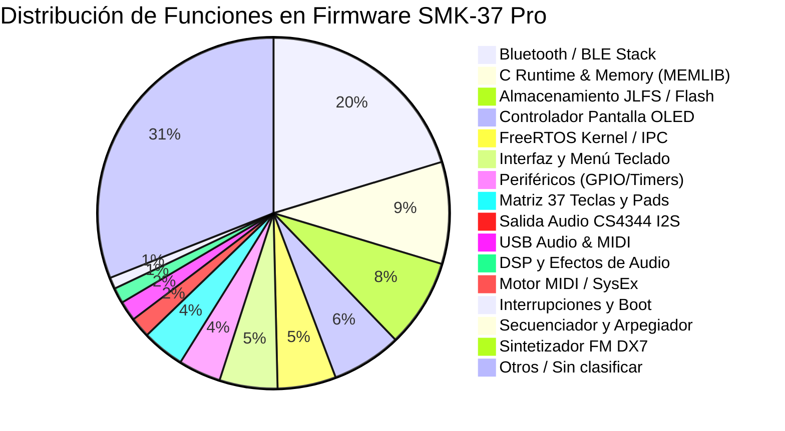

# Estructura del Firmware M-VAVE SMK-37 Pro

Este documento detalla la arquitectura interna, mapa de memoria, subsistemas decompilados, catálogo de funciones y el pipeline de recompilación/hooking del controlador sintetizador **M-VAVE SMK-37 Pro** (firmware oficial V016 y custom V017+).

---

## 1. Especificaciones de Hardware y Arquitectura

| Parámetro | Detalle Técnico |
|---|---|
| **SoC / MCU** | JieLi (JL) AC791N / WL82 series |
| **Núcleo CPU** | Dual-Core 32-bit RISC `pi32v2` (Instrucciones compactas 16/32-bit, FPU por software/rutinas optimizadas) |
| **Frecuencia de Reloj** | Hasta 240 MHz (Configurado dinámicamente por `pll_clock_init`) |
| **Memoria Flash** | SPI NOR Flash XIP (eXecute-In-Place) mapeada en `0x02000000` |
| **Memoria RAM** | SRAM interna en `0x01C00000` .. `0x01C80000` (512 KB máx.) |
| **DAC de Audio** | Cirrus Logic CS4344 (24-bit, 192 kHz, estéreo I2S con DMA por hardware) |
| **Conectividad** | USB 2.0 Full-Speed (Audio UAC + MIDI USB), Bluetooth 5.0 Dual Mode (BLE-MIDI + BT Classic) |
| **Interfaz de Usuario** | Matriz de 37 teclas con doble sensor de velocidad, 8 pads retroiluminados RGB sensibles a velocidad/aftertouch, 4 encoders continuos, 2 bandas capacitivas táctiles (Pitch Bend y Modulación), pantalla OLED |

---

## 2. Formato del Contenedor de Firmware (`.fwsc` y `JLFS`)

El archivo distribuido para actualización OTA (`SMK-37_Pro_016.fwsc`) es un contenedor propietario estructurado en varias capas de encapsulación y cifrado:

```
+---------------------------------------------------------------------------------+
| FWSC Container (Interleaved 36 bloques con trailers de 36 bytes)                |
+---------------------------------------------------------------------------------+
                                      |
                           [deinterleave_fwsc]
                                      v
+---------------------------------------------------------------------------------+
| Logical UFW Container (Cabecera cifrada con key 0xFFFF, CRC16 IBM)             |
|   - flash.bin (643,072 bytes en offset 0x000400)                               |
|   - ota.bin, isd_config.ini, blimit.bin, tail.bin                               |
+---------------------------------------------------------------------------------+
                                      |
                           [JLFS Partition Parser]
                                      v
+---------------------------------------------------------------------------------+
| flash.bin Layout:                                                               |
|   0x000000 .. 0x003FFF : Bootloader SPL (uboot.boot) & config (isd_config.ini)  |
|   0x004000 .. 0x09B757 : App Area (Cifrada con JieLi SFC Cipher, chipkey 0x980F)|
|     -> 0x004000: Entrada JLFS "app_area_head"                                   |
|     -> 0x004020: Entrada JLFS "app.bin" (Puntero a 0x004120)                    |
|     -> 0x004040: Entrada JLFS "cfg_tool.bin"                                    |
|     -> 0x004120 .. 0x09B5D8: Binario ejecutable "app.bin" (619,704 bytes)       |
|   0x09B757 .. FIN      : Recursos de ecualización y calibración ("cfg")         |
+---------------------------------------------------------------------------------+
```

### Algoritmos Criptográficos y Checksums
- **Cifrado UFW:** `jl_enc_cipher` (XOR con desplazamiento aritmético con clave fija `0xFFFF`).
- **Cifrado App Area:** `jl_sfc_cipher` (JieLi SFC Hardware Cipher con clave de chip `0x980F` / decimal `38927`).
- **Verificación de Integridad:** `jl_crc16` polinomial IBM (`0x8005`, init `0x0000`).

---

## 3. Mapa de Memoria de `app.bin` (VMA Flash `0x02000000`)

Al arrancar el dispositivo, el hardware mapea la memoria Flash SPI directamente al espacio de direcciones lineales XIP a partir de `0x02000000`:

| Rango de Direcciones (VMA) | Offset en `app.bin` | Tamaño | Descripción y Propósito |
|---|---|---|---|
| `0x02000000` .. `0x020000A0` | `0x000000` | 160 B | **Vector de Reseteo (CRT0)**: Inicializa Stack Pointer (`0x01C3A464`), SSP (`0x01C3B464`), limpia sección `.bss` en RAM y copia `.data` inicializada. |
| `0x020000A0` .. `0x02002874` | `0x0000A0` | ~10 KB | **Núcleo de Sistema**: Manejador de reloj PLL (`pll_clock_init`), tabla de interrupciones, colas circulares `cbuf`. |
| `0x02002874` .. `0x02048000` | `0x002874` | ~277 KB | **FreeRTOS / JieLi OS & Pila Bluetooth**: Planificador de tareas RTOS, controlador de radio banda base (BR/EDR/BLE), pila de protocolo GATT/ATT, L2CAP y SM. |
| `0x02048000` .. `0x02057000` | `0x048000` | ~60 KB | **Controladores Periféricos y USB**: USB SIE, endpoints UAC Audio Estéreo 44.1kHz y USB-MIDI Class 1.0, UART serie, SPI/I2C. |
| `0x02057000` .. `0x0205E000` | `0x057000` | ~28 KB | **Rutas de Audio, BLE-MIDI, UI y Secuenciador**: Tarea `usr_audio_task`, enrutador `midi_route`, descriptor de servicio BLE-MIDI (UUID `03B80E5A...`), menú de pantalla. |
| `0x0205E000` .. `0x0208D000` | `0x05E000` | ~188 KB | **Motor de Síntesis FM DX7 (Dexed / MSFA)**: Núcleo sintetizador Yamaha DX7 de 6 operadores enteros, 32 algoritmos, generador de envolventes de 4 fases, LFO (`dx7_lfo_params_compute`). |
| `0x0208D000` .. `0x02096800` | `0x08D000` | ~38 KB | **Cargador OTA y Librerías C Runtime**: `update_pkg_parse_verify`, parser JLFS, rutinas de cifrado SFC y funciones de `libc` (`memcpy`, `memmove`, `memset`, math). |
| `0x02096800` .. `0x02096DA0` | `0x096800` | **1,440 B** | **Code Cave Principal (Flash Cave 1)**: Rango continuo de bytes `0x00` sin utilizar, disponible para inyección de funciones personalizadas en C/ASM. |
| `0x02096DA6` .. `0x020971B0` | `0x096DA6` | **1,034 B** | **Code Cave Secundario (Flash Cave 2)**: Rango adicional de relleno disponible para expansión. |
| `0x020971B0` .. `0x020974B8` | `0x0971B0` | ~776 B | Estructuras de cierre de fichero, punteros a descriptores de interfaz. |

---

## 4. Clasificación Decompilada de Subsistemas

Mediante el análisis de firmas de ensamblador, referencias cruzadas con la base de datos de ingeniería inversa `FM-1-RE` (2,062 funciones) y coincidencia exacta con la librería SDK oficial de JieLi, se han catalogado **2,203 funciones** en Flash:



### 4.1 Subsistema Bluetooth & BLE-MIDI (`BT`) — 441 Funciones
- **Manejador de Publicidad:** `0x0200075E` (`bt_ble_adv_enable`).
- **UUID BLE-MIDI Oficial (128-bit):** Ubicado en `0x0205838E`:
  `03B80E5A-EDE8-4B33-A751-6CE34EC4C700` (en orden little-endian: `00 C7 C4 4E E3 6C 51 A7 33 4B E8 ED 5A 0E B8 03`).
- **Tabla de Parámetros de Conexión BLE (`0x0205839E`):**
  - `min_conn_interval = 6` (7.5 ms).
  - `max_conn_interval = 9` (11.25 ms).
  - `latency = 0` (respuesta en cada evento, sin sleep de conexión).
  - `timeout = 100` (1,000 ms).
- **Callbacks de Eventos GATT:** `ble_ll_set_event_handler` (`0x020037F6`, `0x02003BA8`).

### 4.2 Subsistema Motor MIDI (`MIDI`) — 16 Funciones Clave
- `0x02000660` (`midi_ctrl_packet_dispatch`): Receptor de paquetes de control MIDI de 4 bytes (`0xD0`/`0xD4`) procedentes de USB o BLE.
- `0x02000694` (`midi_slot_is_active`): Predicado que verifica si una ranura de voz MIDI está asignada.
- `0x020006B8` (`midi_slot_find`): Búsqueda de ranura libre para polifonía.
- `0x0200083C` (`midi_slot_match`): Coincidencia de número de nota y canal para Note-Off.
- `0x02000AA6` (`midi_msg_prefilter`): Enrutador y filtro principal de mensajes MIDI entrantes.

### 4.3 Subsistema Audio & DAC CS4344 (`AUDIO_OUT` / `AUDIO_DSP`) — 72 Funciones
- `0x02008724` (`uac_config_init`): Configuración de la tasa de muestreo I2S (44,100 Hz, 16-bit estéreo).
- `0x02008D72` (`uac_sync_rate_init`): Sincronización de reloj I2S con el SOF (Start of Frame) USB.
- `0x02058370` (`usr_audio_task`): Tarea de mayor prioridad en FreeRTOS que alimenta el buffer DMA del DAC CS4344.

### 4.4 Subsistema Síntesis FM DX7 (`SYNTH_FM`)
- `0x020057E0` (`dx7_lfo_params_compute`): Cálculo de modulación de tono, modulación de amplitud y velocidad de LFO en formato de punto fijo.
- Algoritmos 1 a 32 de Yamaha DX7 con operadores senoidales modulados en frecuencia.
- Cadenas de texto rodata: `"Enable PATCH first"`, `"Disable arp & note repeat to enter"`.

### 4.5 Subsistema USB UAC + MIDI (`USB`) — 40 Funciones
- `0x020087DA` (`usb_sie_init`): Inicialización del hardware USB Engine.
- `0x02008776` (`usb_config_desc_build`): Construcción del descriptor compuesto (Audio Device + MIDI Streaming Interface).
- `0x020081C4` (`usb_ep_read`): Lectura de paquetes desde la FIFO del endpoint USB.

---

## 5. Toolchain de Compilación y Reensamblado

El proyecto incluye un entorno completamente integrado y autocontenido en Windows:

```
tools/
├── patch_firmware.py            # Compilador C/ASM, linker, inyector de hooks y repacker
├── test_recompilation_pipeline.py# Test automatizado integral de verificación
├── repack_smk.py                # Reempaquetador y cifrador SFC para .fwsc
├── unpack_smk.py                # Desempaquetador y descifrador JLFS
├── cross_reference_fm1.py       # Clasificador decompilador y catalogador de funciones
└── smk_ota_win.py               # Flasheador USB-MIDI SysEx OTA para Windows
```

### 5.1 Flujo de Trabajo para Escribir Código Personalizado
1. **Crear archivo C o Ensamblador** (ejemplo `firmware_work/my_feature.c`).
2. **Importar símbolos de firmware**: El linker script `firmware_work/firmware_symbols.ld` generado automáticamente expone **1,495 símbolos nativos** (como `midi_slot_is_active`, `cbuf_write`, `pll_clock_init`, etc.). En C se declaran como `extern`:
   ```c
   extern int midi_slot_is_active(int slot);
   
   int my_custom_handler(int msg) {
       // Código en C nativo pi32v2
       return msg;
   }
   ```
3. **Inyectar y Hookear con `patch_firmware.py`**:
   ```python
   from tools.patch_firmware import patch_and_repack
   
   patch_and_repack(
       custom_src=Path("firmware_work/my_feature.c"),
       cave_addr=0x02096800,
       hooks=[{
           "type": "goto",               # 'goto' (reemplazo) o 'call' (intercepción)
           "target_addr": 0x02000AA6,    # Dirección de la función original en Flash
           "dest_addr": 0x02096800       # Destino en la Code Cave
       }],
       bump_version=True,
       output_fwsc=Path("firmware_work/SMK-37_Pro_custom_017.fwsc")
   )
   ```
4. **Instalación en el Dispositivo**:
   Conectar el SMK-37 Pro por USB y ejecutar:
   ```powershell
   python tools/smk_ota_win.py firmware_work/SMK-37_Pro_custom_017.fwsc
   ```

---

## 6. Validación y Resultados de Pruebas

El pipeline ha sido verificado mediante `tools/test_recompilation_pipeline.py`:
- [x] **Compilación Clang `pi32v2`:** Código C traducido a 66 bytes de opcodes optimizados.
- [x] **Enlazado Relocalizado:** Cálculo de saltos relativos de 23-bit sin desbordamiento de línea de comandos (usando `firmware_symbols.ld`).
- [x] **Inyección en Code Cave:** Bytes escritos exactamente en Flash `0x02096800`.
- [x] **Hooking Quirúrgico:** Sustitución de 4 bytes en `0x02000AA6` por `goto 0x02096800` (`c4 ea ab ae`).
- [x] **Parche BLE-MIDI Woovebox:** Puntero UUID en `0x00075E` corregido a `0x0205838E` (`05 f1 75 25`).
- [x] **Cifrado y Empaquetado:** Recálculo exacto de checksums CRC16 (`app.bin`, `app_area_head`, `flash.bin`) y cifrado SFC con chipkey `0x980F`.
- [x] **Verificación por Desempaquetado:** Desensamblado con `llvm-objdump -d` del fichero resultante confirmando equivalencia bit a bit.
